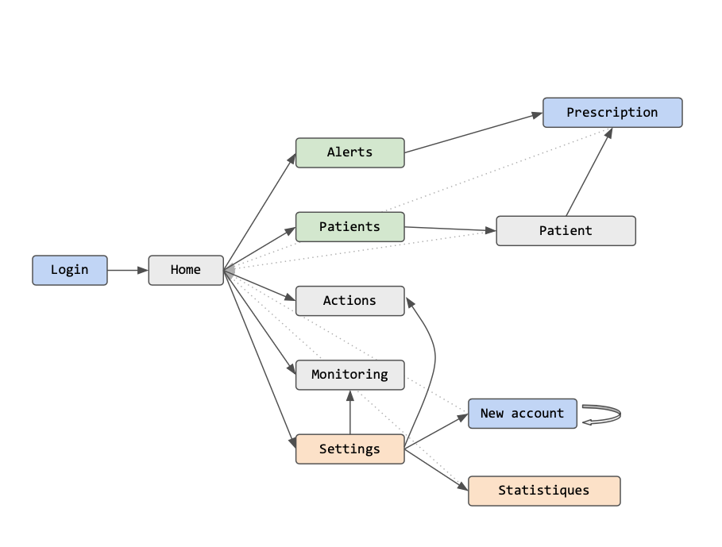
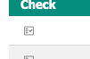
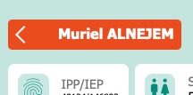
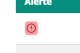
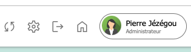
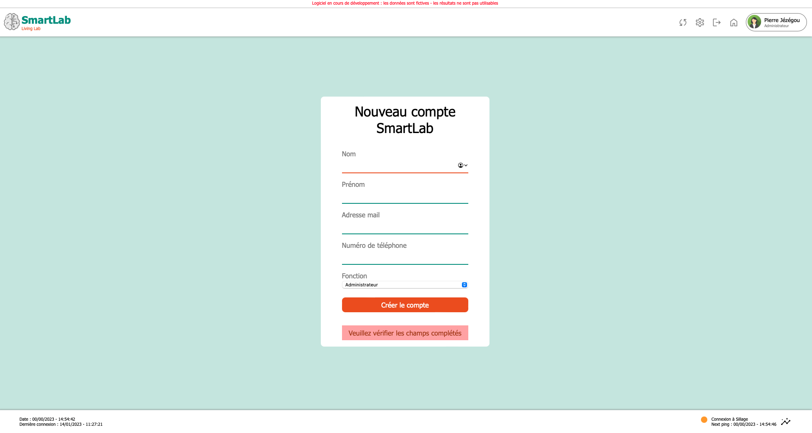

# Notice d'utilisation du logiciel SMARTLAB by LivingLab

## Structure de l'interface
L'interface se découpe en plsuieurs pages qui communiquent entre-elles comme le schéma ci-dessous le laisse voir. Nous avons essayé de créer les liens les plus logiques possibles en fonction des besoins des pharmaciens. Pour plus de détails sur l'agencement des âges, voir la section 'Utilisation de l'interface'

Chaque page est structurée de la même manière :
- Une barre d'en-tête :
    - A gauche, le logo cliquable pour revenir à la page d'accueil
    - A droite, les boutons cliquables pour se déplacer vers les pages liées.
- Un pied de page qui comprend :
    - A gauche l'heure de dernière connexion et l'heure actuelle
    - A droite les statistiques (faussées actuellement) de connexion aux logiciels de flux de données de l'hopital

## Navigation entre les pages
La navigation entre les pages se fait au moyen de clics sur des boutons adaptés. Cela peut être des boutons de connexion, mais également des liens cliquables dans les tableaux.

## Création d'un compte
La création d'un compte pour un nouvel acteur doit se faire via l'interface d'un administrateur. Pour cela, prendre contact avec un des administrateurs.\
De son côté, il devra :
- Cliquer sur la roue dentée en haut à droite dans l'entête
- Cliquer sur "nouveau compte"
- Renseigner les coordonnées

Un mail vous sera alors envoyé vous donant votre nom d'utilisateur (première lettre du prénom et nom de famille en minuscule, sans accent, sans espace) et votre mot de passe provisoire. Il n'est pas encore possible de modifier le mot de passe.

s

# Utilisation de l'interface (cas concret)
Pour cette notice d'utilisation, nous nous mettons dans la peau d'un pharmacien qui doit valider ou modifier les prescriptions qui ont été produites dans les différents services d'un hôpital.\
1. Dans un premier temps le pharmacien se connecte à l'interface avec les informations de connexion qu'il a reçu par mail lors de son inscription
2. Ensuite, en arrivant sur la page d'accueil, il regarde le nombre d'alertes qu'il reste àn traiter.
3. Il peut aller au choix vers :
    - Le monitoring pour regarder les informations de connexion aux autres logiciels hospitaliers
    - Le suivi de ses actions qui recense toutes les tâches effectuées par le passé
    - La liste des patients
    - La liste des prescriptions que l'IA a jugé fausse
    - /!\ S'il est administrateur il peut aller

